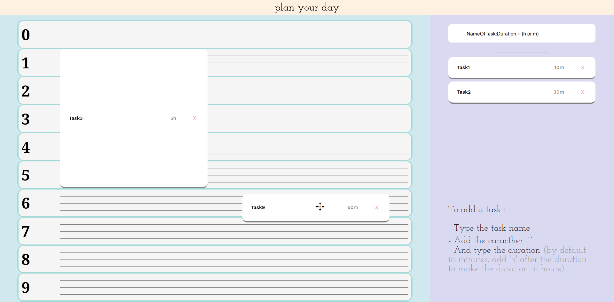

# calendar_concept

A calendar, where the flow of the ideas you want to do can be express,
just type all the things and the duration of what you have in mind,
then you can simply drag them into the calendar !

## Images


## Project Setup

```sh
npm install
```

### Compile and Hot-Reload for Development

```sh
npm run dev
```

### Type-Check, Compile and Minify for Production

```sh
npm run build
```

### Lint with [ESLint](https://eslint.org/)

```sh
npm run lint
```
